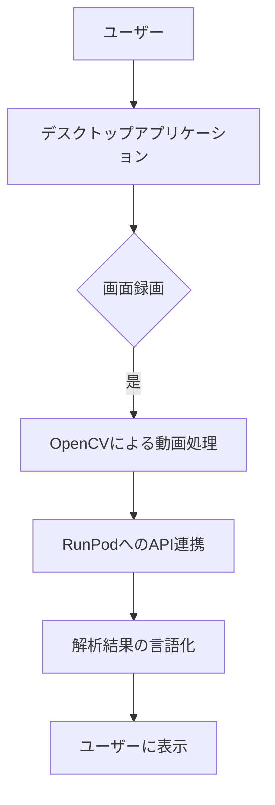

# 提案書

## 1. 提案概要
既存デスクトップアプリケーションを基に、画面録画機能や動画ファイル選択機能などの追加開発を行います。AI推論APIとの連携により、録画した動画を解析し、その結果を言語化します。

## 2. 技術選定と理由
- **Python**: 脚本言語としての柔軟性と豊富なライブラリが利点です。
- **RunPod**: AI推論APIとの連携に適したクラウドサービスです。スケーラビリティとコスト効率が高く、実行速度も速いです。
- **OpenCV**: 動画処理や画像認識のための強力なライブラリです。

## 3. アーキテクチャ図

## 4. 開発アプローチ
1. **詳細設計**: 概要仕様書に基づき、各機能の詳細設計を行います。
2. **実装**:
   - デスクトップアプリケーションの開発
   - 画面録画機能の実装
   - 動画ファイル選択機能の実装
   - OpenCVによる動画前処理
   - RunPodとのAPI連携
   - 解析実行および進捗表示
   - エラーハンドリング
   - 設定画面の実装
3. **テスト**: 単体テストと統合テストを行い、品質を確保します。

## 5. 本提案の強み
1. **過去の実績**: Pythonでのデスクトップアプリケーション開発で複数のプロジェクトに携わった経験があります。
2. **技術選定**: RunPodとOpenCVを使用することで、高速なAI推論と効率的な動画処理が可能になります。
3. **品質保証**: 単体テストと統合テストを行い、品質を確保します。